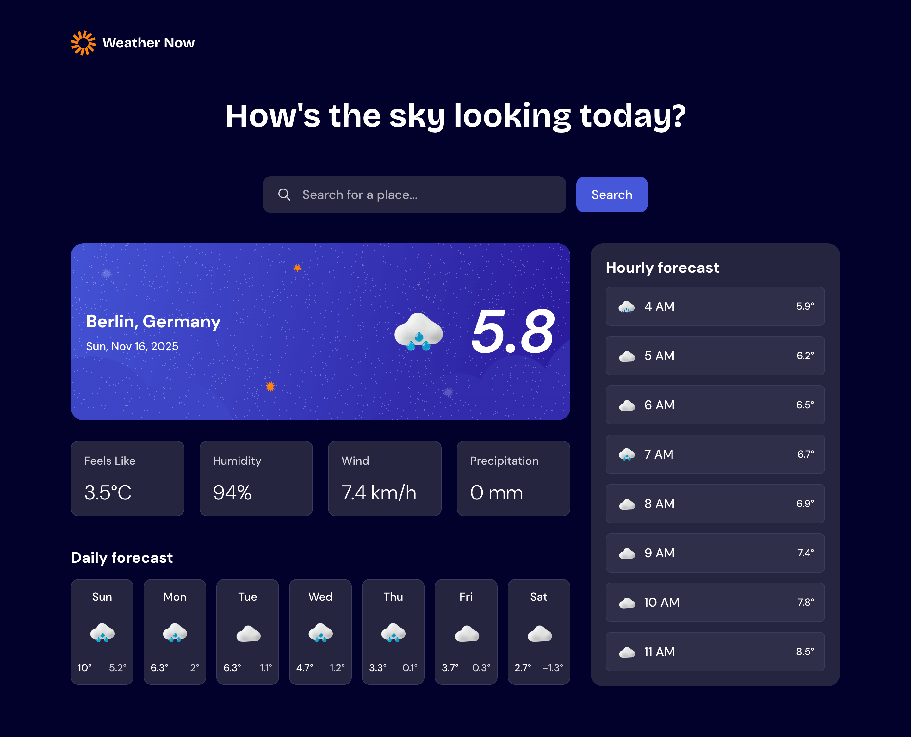
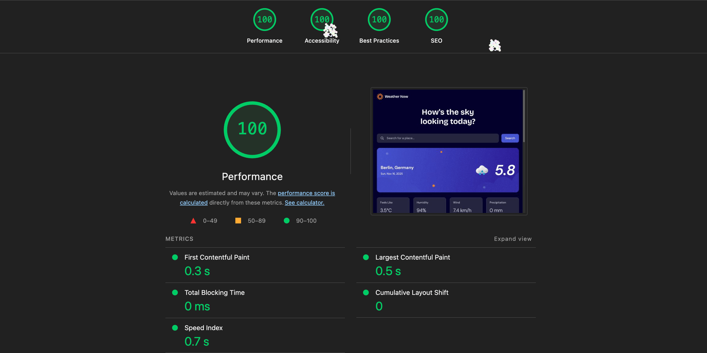

# Weather App

This is a solution to the [Weather app challenge on Frontend Mentor](https://www.frontendmentor.io/challenges/weather-app-K1FhddVm49).

## Table of contents

- [The challenge](#the-challenge)
- [Preview](#screenshot)
- [Lighthouse Report](#lighthouse-report)
- [Built with](#built-with)

## Overview

### The challenge

Users should be able to:

- Search for weather information by entering a location in the search bar
- View current weather conditions including temperature, weather icon, and location details
- See additional weather metrics like "feels like" temperature, humidity percentage, wind speed, and precipitation amounts
- Browse a 7-day weather forecast with daily high/low temperatures and weather icons
- View an hourly forecast showing temperature changes throughout the day
- Switch between different days of the week using the day selector in the hourly forecast section
- Toggle between Imperial and Metric measurement units via the units dropdown
- Switch between specific temperature units (Celsius and Fahrenheit) and measurement units for wind speed (km/h and mph) and precipitation (millimeters) via the units dropdown
- View the optimal layout for the interface depending on their device's screen size
- See hover and focus states for all interactive elements on the page

> **Note:** This solution implements the core functionality of the challenge. Some optional features were intentionally omitted to focus on exploring modern web development techniques with SvelteKit.

### Preview

### Lighthouse Report

Lighthouse report is an automated evaluation of a web page’s quality. It audits a page across several categories and gives scores plus detailed recommendations.

## Built with

- **[SvelteKit](https://svelte.dev/)** - Modern web framework with excellent DX
- **Semantic HTML5** - Accessible markup structure
- **CSS Custom Properties** - Design system implementation with fluid typography
- **Flexbox & CSS Grid** - Responsive layout techniques
- **Vitest** - Component testing with browser mode
